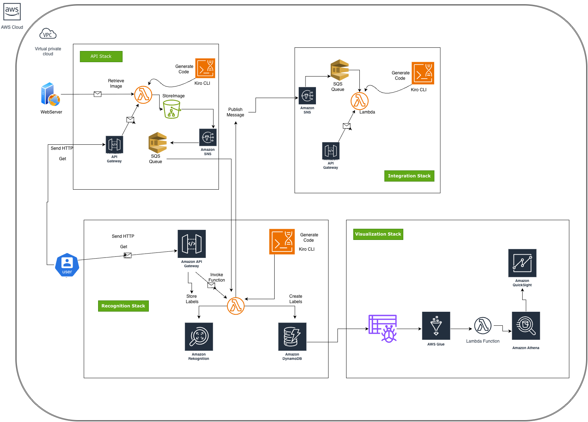

# Image Rekognition

An AWS-based image processing pipeline built with Python and AWS CDK. The system accepts image URLs via a REST API, runs Amazon Rekognition label detection on each image, persists the results in DynamoDB, forwards them as XML to a downstream endpoint, and visualises the data in Amazon QuickSight via Athena federated queries.

---

## Architecture



### Data Flow Diagram

```
User → API Gateway (APIStack)
         └─ ImageGetAndSaveLambda → S3 (image bucket)
                                      └─ SNS → SQS (upload queue)
                                                 └─ image_recognition Lambda (RekognitionStack)
                                                      ├─ Rekognition DetectLabels
                                                      ├─ DynamoDB (Classifications table)
                                                      └─ SNS → SQS (rekognized queue)
                                                                  └─ IntegrationLambda (IntegrationStack)
                                                                       ├─ SSM (endpoint URL)
                                                                       └─ SaveXMLLambda via API Gateway

DynamoDB → Athena federated query (VisualizationStack)
             └─ Glue Data Catalog → QuickSight
```

### Stacks

| Stack | Domain | Key Resources |
|-------|--------|---------------|
| **APIStack** | Image ingestion | API Gateway, `ImageGetAndSaveLambda`, S3 image bucket, SNS topic, SQS upload queue |
| **IntegrationStack** | Downstream forwarding | SNS topic, SQS rekognized queue, `IntegrationLambda`, `SaveXMLLambda`, API Gateway, SSM parameter, S3 XML bucket |
| **RekognitionStack** | Image classification | `image_recognition` Lambda, `ListImagesLambda`, DynamoDB Classifications table, API Gateway |
| **VisualizationStack** | Analytics | Athena DynamoDB connector (SAR), Glue crawler, Athena workgroup, QuickSight data source |

### Data Flow

1. Client calls `GET /?url=<image_url>&name=<filename>` on the upload API.
2. `ImageGetAndSaveLambda` downloads the image and writes it to S3.
3. S3 fires an `ObjectCreated:Put` event → SNS → SQS upload queue.
4. `image_recognition` Lambda polls the queue, calls `rekognition:DetectLabels` (max 10 labels, 70% min confidence), writes results to DynamoDB, and publishes to the rekognized SNS topic.
5. `IntegrationLambda` polls the rekognized queue, converts the result to XML, and POSTs it to the `SaveXMLLambda` endpoint (URL stored in SSM Parameter Store).
6. `SaveXMLLambda` saves the XML payload to S3 with a timestamped key.
7. QuickSight queries DynamoDB via Athena federated queries (Athena DynamoDB connector → Glue Data Catalog).

---

## Project Assets Checklist

### Core Infrastructure Files
- ✅ `app.py` - CDK app entry point with all 4 stacks
- ✅ `cdk.json` - CDK context configuration
- ✅ `requirements.txt` - Runtime dependencies
- ✅ `requirements-dev.txt` - Development dependencies
- ✅ `deploy.sh` - Deployment automation script
- ✅ `requests_layer3_11.zip` - Pre-built Lambda layer for requests library

### Lambda Functions

#### APIStack (Image Ingestion)
- ✅ `api/infrastructure.py` - CDK stack definition
- ✅ `api/runtime/get_save_image.py` - Lambda: downloads and saves images to S3
- ⚠️ `api/runtime/get_save_image_solution.py` - **MISSING** (reference implementation)

#### RekognitionStack (Image Classification)
- ✅ `recognition/infrastructure.py` - CDK stack definition
- ✅ `recognition/runtime/image_recognition.py` - Lambda: runs Rekognition DetectLabels
- ✅ `recognition/runtime/list_images.py` - Lambda: scans DynamoDB for classified images
- ⚠️ `recognition/runtime/image_recognition_solution.py` - **MISSING** (reference implementation)
- ⚠️ `recognition/runtime/list_images_solution.py` - **MISSING** (reference implementation)

#### IntegrationStack (Downstream Forwarding)
- ✅ `integration/infrastructure.py` - CDK stack definition
- ✅ `integration/runtime/send_email.py` - Lambda: converts results to XML and POSTs
- ✅ `integration/runtime/SaveXMLLambda.py` - Lambda: receives and saves XML to S3
- ⚠️ `integration/runtime/send_email_solution.py` - **MISSING** (reference implementation)

#### VisualizationStack (Analytics)
- ✅ `visualization/infrastructure.py` - CDK stack definition (Athena + Glue + QuickSight)

### IAM Policy Documents
- ✅ `iam/deployer-user-policy.json` - Main deployer permissions
- ✅ `iam/deployer-policy-1-infra.json` - Infrastructure permissions
- ✅ `iam/deployer-policy-2-compute.json` - Compute permissions
- ✅ `iam/deployer-policy-3-analytics.json` - Analytics permissions
- ✅ `iam/fix-cdk-bootstrap-trust.sh` - CDK bootstrap trust policy fixer
- ✅ `iam/glue-crawler-role.json` - Glue crawler IAM role
- ✅ `iam/lambda-*-role.json` - Per-Lambda IAM role definitions (8 files)
- ✅ `iam/quicksight-athena-policy.json` - QuickSight Athena access policy

### Utility Scripts
- ✅ `scan_classifications.py` - CLI utility to scan/seed DynamoDB table
- ✅ `send_images.py` - Test script to send images to the API

### Documentation & Diagrams
- ✅ `README.md` - This comprehensive documentation
- ✅ `../../Concepts/Recognition.drawio.png` - Architecture diagram
- ✅ `../../Concepts/AI-DevelopmentLifeCycle-Spectrum.png` - AI SDLC concepts
- ✅ `../../Concepts/VibeCoding.png` - Vibe coding methodology
- ✅ `../../Concepts/Steering.png` - Steering documentation concept
- ✅ `../../Examples/athena.csv` - Sample Athena query results
- ✅ `../../Examples/*.pdf` - Traffic analysis reports

### Output Files (Generated)
- 🔄 `cdk-outputs-APIStack.json` - API stack outputs (generated after deployment)
- 🔄 `cdk-outputs-IntegrationStack.json` - Integration stack outputs
- 🔄 `cdk-outputs-RekognitionStack.json` - Rekognition stack outputs
- 🔄 `cdk-outputs-VisualizationStack.json` - Visualization stack outputs

### Notes
- ⚠️ **Missing Solution Files**: The README mentions `*_solution.py` files as reference implementations for workshop participants, but these are not present in the current project structure. These files should contain working implementations for candidates to reference.
- ✅ **All critical infrastructure files** for deployment are present
- ✅ **All IAM policies** are documented and available
- ✅ **Architecture diagram** has been added to the README

---

## Project Structure

```
python/
├── app.py                          # CDK app entry point — instantiates all 4 stacks
├── cdk.json                        # CDK context config (bucket names, prefixes, flags)
├── deploy.sh                       # Main deploy/destroy/diff script
├── requirements.txt                # Runtime deps (aws-cdk-lib, constructs, boto3)
├── requirements-dev.txt            # Dev deps
├── scan_classifications.py         # CLI utility to scan/seed the DynamoDB table
├── requests_layer3_11.zip          # Pre-built Lambda layer (requests lib for Python 3.11)
│
├── api/                            # APIStack
│   ├── infrastructure.py
│   └── runtime/
│       ├── get_save_image.py       # Lambda: downloads image from URL, saves to S3
│       └── get_save_image_solution.py
│
├── recognition/                    # RekognitionStack
│   ├── infrastructure.py
│   └── runtime/
│       ├── image_recognition.py    # Lambda: runs Rekognition, writes to DynamoDB, triggers SNS
│       ├── image_recognition_solution.py
│       ├── list_images.py          # Lambda: scans DynamoDB, returns all classified images
│       └── list_images_solution.py
│
├── integration/                    # IntegrationStack
│   ├── infrastructure.py
│   └── runtime/
│       ├── send_email.py           # Lambda: converts rekognition results to XML, POSTs to endpoint
│       ├── send_email_solution.py
│       └── SaveXMLLambda.py        # Lambda: receives XML POST, saves to S3
│
├── visualization/                  # VisualizationStack
│   └── infrastructure.py
│
├── iam/                            # IAM policy documents and helper scripts
│   ├── deployer-user-policy.json   # Minimum permissions for the deploy IAM user
│   ├── fix-cdk-bootstrap-trust.sh  # Patches CDK bootstrap role trust policies
│   └── *.json                      # Per-Lambda IAM role definitions (reference)
│
└── cdk-outputs-*.json              # Stack outputs written by deploy.sh (gitignored)
```

> **Note:** The README references `*_solution.py` files as workshop reference implementations, but these files are currently missing from the project. Only the base Lambda implementations are present. If this is intended as a workshop, the solution files should be added to provide participants with working reference code.

---

## Tech Stack

| Layer | Technology |
|-------|-----------|
| Language | Python 3.11 |
| IaC | AWS CDK v2 (`aws-cdk-lib==2.118.0`) |
| AWS SDK | boto3 `1.34.144` |
| Lambda layer | `requests` library (`requests_layer3_11.zip`) |
| Image classification | Amazon Rekognition `DetectLabels` |
| Storage | S3 (images, XML payloads, Athena results/spill) |
| Database | DynamoDB (Classifications table, partition key: `image`) |
| Messaging | SNS + SQS (all queues have DLQs + CloudWatch alarms) |
| Config | SSM Parameter Store (third-party endpoint URL) |
| Analytics | Athena federated query → Glue Data Catalog → QuickSight |
| Observability | CloudWatch (Lambda error alarms, DLQ alarms, API Gateway metrics) |

---

## Prerequisites

- Python 3.11
- Node.js (for AWS CDK CLI): `npm install -g aws-cdk`
- AWS CLI v2 configured: `aws configure`
- An AWS account with QuickSight subscribed (required for VisualizationStack)

---

## Setup

All commands run from the `python/` directory.

```bash
cd python

# Create and activate a virtual environment
python3 -m venv .venv
source .venv/bin/activate

# Install dependencies
pip install -r requirements.txt
```

---

## CDK Context Keys

Configured in `cdk.json`. Override at deploy time with `-c key=value`.

| Key | Default | Purpose |
|-----|---------|---------|
| `asset_bucket` | `cloudage-resources-715` | S3 bucket holding the Lambda layer zip |
| `image_bucket_prefix` | `sagemaker` | Prefix for the image bucket (`<prefix>-<region>-<account>`) |
| `layer_zip_key` | `requests_layer3_11.zip` | S3 key for the requests layer |
| `quicksight_user` | `gen-ai-user` | QuickSight username for data source ownership |
| `image_bucket_exists` | `"false"` | Set automatically by `deploy.sh`; controls import vs create for the image bucket |

---

## Deployment

### Deploy all stacks

```bash
./deploy.sh
```

`deploy.sh` handles everything automatically:
1. Verifies AWS CLI, CDK, and Python venv
2. Runs `cdk bootstrap` if not already done
3. Creates the asset S3 bucket and uploads the Lambda layer zip if needed
4. Detects whether the image bucket already exists and sets `image_bucket_exists` accordingly
5. Cleans up orphaned named resources from previous deployments
6. Deploys all 4 stacks in dependency order
7. Starts the Glue crawler to populate the Athena schema
8. Attaches `AWSQuicksightAthenaAccess` to the QuickSight service role

### Deploy a single stack

```bash
./deploy.sh --stack APIStack
# Valid: APIStack, IntegrationStack, RekognitionStack, VisualizationStack
```

### Preview changes without deploying

```bash
./deploy.sh --diff
```

### Destroy all stacks

```bash
./deploy.sh --destroy
```

> Resources with `RemovalPolicy.RETAIN` (S3 image bucket, DynamoDB Classifications table) are **not** deleted on destroy.

### Clean up orphaned named resources

Run this before redeploying into an account that has leftover resources from a previous deployment:

```bash
./deploy.sh --cleanup
```

Removes: Athena workgroup, Athena data catalog, Glue crawler, Glue database, QuickSight data source, SAR connector Lambda.

---

## Stack Deployment Order

The stacks have explicit dependencies and must be deployed in this order:

```
1. APIStack          — creates S3 image bucket, SQS upload queue, SNS topic
2. IntegrationStack  — creates SNS rekognized topic, SQS rekognized queue, SaveXMLLambda
3. RekognitionStack  — needs SQS ARN (APIStack) + SNS ARN (IntegrationStack)
4. VisualizationStack — needs DynamoDB table name from RekognitionStack outputs
```

`deploy.sh` handles this order automatically. The `VisualizationStack` reads the DynamoDB table name from `cdk-outputs-RekognitionStack.json` at synth time — deploy `RekognitionStack` first if deploying stacks individually.

---

## Post-Deployment

### Start the Glue crawler

Run once after deploying `VisualizationStack` to populate the Glue Data Catalog schema (required for Athena queries from QuickSight):

```bash
aws glue start-crawler --name dynamodb-classifications-crawler --region <region>
```

`deploy.sh` runs this automatically on a full deploy.

### Seed test data

```bash
# Seed sample classification records into DynamoDB
python scan_classifications.py --seed --region <region>

# Scan and print all records
python scan_classifications.py --region <region>
```

### Test the upload API

```bash
# Get the API endpoint from the stack outputs
cat cdk-outputs-APIStack.json

# Upload an image by URL
curl "https://<api-id>.execute-api.<region>.amazonaws.com/prod/?url=https://example.com/photo.jpg&name=photo.jpg"
```

### List classified images

```bash
cat cdk-outputs-RekognitionStack.json
curl "https://<api-id>.execute-api.<region>.amazonaws.com/prod/"
```

---

## IAM

### Deployer permissions

Attach `iam/deployer-user-policy.json` to the IAM user running `cdk deploy`. The policy is split across three files for readability:

| File | Covers |
|------|--------|
| `deployer-policy-1-infra.json` | S3, SSM, CloudFormation, CDK bootstrap |
| `deployer-policy-2-compute.json` | Lambda, API Gateway, SQS, SNS, DynamoDB |
| `deployer-policy-3-analytics.json` | Athena, Glue, QuickSight, Rekognition |

### Fix CDK bootstrap trust policies

Run once after `cdk bootstrap` to eliminate "could not assume role" warnings:

```bash
./iam/fix-cdk-bootstrap-trust.sh
```

`deploy.sh` runs this automatically on every deploy.

### Athena DynamoDB connector Lambda role

The SAR connector requires these four AWS managed policies (confirmed from production):

- `service-role/AWSLambdaBasicExecutionRole`
- `AmazonDynamoDBFullAccess`
- `AmazonS3FullAccess`
- `service-role/AWSQuicksightAthenaAccess`

CDK attaches these automatically via `ConnectorLambdaRole` in `visualization/infrastructure.py`.

### QuickSight service role

`AWSQuicksightAthenaAccess` must be attached to `aws-quicksight-service-role-v0`. `deploy.sh` does this automatically. To attach manually:

```bash
aws iam attach-role-policy \
  --role-name aws-quicksight-service-role-v0 \
  --policy-arn arn:aws:iam::aws:policy/service-role/AWSQuicksightAthenaAccess
```

---

## Key Design Decisions

- **SQS visibility timeout** — set to ≥ 6× the Lambda timeout to prevent duplicate processing. Upload queue: 360s (Lambda timeout 30s). Rekognized queue: 1800s (Lambda timeout 300s).
- **DLQs** — every SQS queue has a dead-letter queue with a CloudWatch alarm on `ApproximateNumberOfMessagesVisible`.
- **S3 buckets** — all buckets use `BLOCK_ALL` public access, S3-managed encryption, SSL enforcement, and `RETAIN` removal policy (except Athena spill/results buckets which use `DESTROY` with a lifecycle rule).
- **Cross-stack values** — passed as plain strings (constructor parameters), not CDK tokens, to avoid CloudFormation export locks.
- **boto3 clients** — instantiated at module level (outside the handler) for Lambda connection reuse.
- **Logging** — `logging` module with `logger.setLevel(logging.INFO)`; no bare `print()` in Lambda handlers.
- **CDK context** — all runtime config (bucket names, prefixes) flows through `cdk.json` context keys; never hardcoded.

---

## Known Issues & Fixes

### S3 bucket event notification missing after redeploy

The image S3 bucket has `RemovalPolicy.RETAIN` — it survives stack destroy. On redeploy, CDK imports the existing bucket but cannot re-add the event notification via CloudFormation. `deploy.sh` detects this and sets `image_bucket_exists=true`, which grants the SNS topic policy instead.

If the notification is still missing after deploy, add it manually:

```bash
aws s3api put-bucket-notification-configuration \
  --bucket sagemaker-<region>-<account> \
  --notification-configuration '{
    "TopicConfigurations": [{
      "TopicArn": "<uploaded_image_topic_arn>",
      "Events": ["s3:ObjectCreated:Put"]
    }]
  }' \
  --region <region>
```

Get the topic ARN from `cdk-outputs-APIStack.json`.

### Athena workgroup delete fails on destroy

AWS returns 400 if the workgroup contains saved queries. `deploy.sh --destroy` runs `cleanup_orphaned_resources` first, which uses `--recursive-delete-option` to force-delete the workgroup.

### image_recognition Lambda event source mapping missing

CDK generates a random function name if `function_name` is not set. If the event source mapping is missing after deploy:

```bash
aws lambda create-event-source-mapping \
  --function-name <actual-function-name> \
  --event-source-arn <uploaded_image_queue_arn> \
  --batch-size 1 \
  --region <region>
```

Get the function name from `aws lambda list-functions --region <region>`.

### VisualizationStack fails if RekognitionStack not deployed first

`app.py` reads the DynamoDB table name from `cdk-outputs-RekognitionStack.json`. If that file doesn't exist, the table name will be empty and the stack will fail. Always deploy `RekognitionStack` before `VisualizationStack`, or override with:

```bash
cdk deploy VisualizationStack -c dynamodb_table_name=<table-name>
```

---

## Useful Console Links

Replace `<region>` with your deployment region (e.g. `eu-central-1`).

| Service | URL |
|---------|-----|
| CloudFormation | `https://<region>.console.aws.amazon.com/cloudformation/home?region=<region>#/stacks` |
| Lambda | `https://<region>.console.aws.amazon.com/lambda/home?region=<region>#/functions` |
| DynamoDB | `https://<region>.console.aws.amazon.com/dynamodbv2/home?region=<region>#tables` |
| Glue Crawlers | `https://<region>.console.aws.amazon.com/glue/home?region=<region>#/catalog/crawlers` |
| Athena | `https://<region>.console.aws.amazon.com/athena/home?region=<region>` |
| QuickSight | `https://<region>.quicksight.aws.amazon.com/` |
